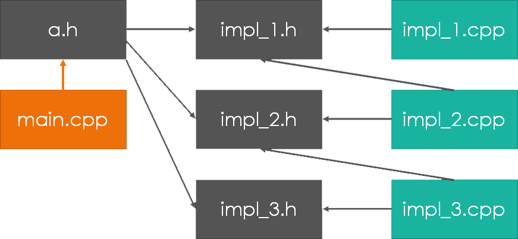
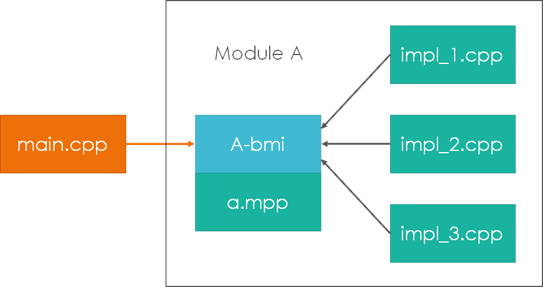
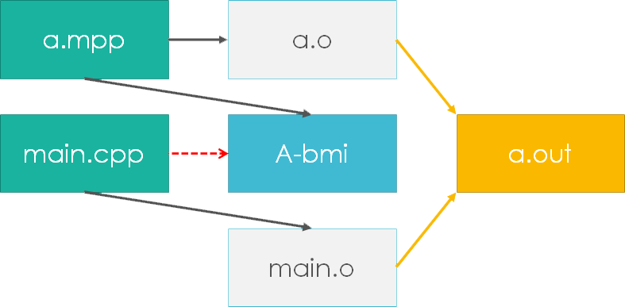
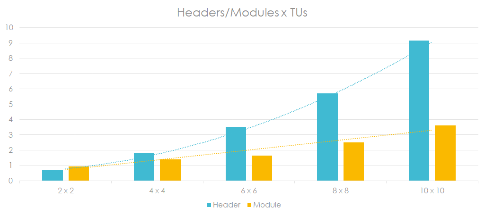

# About C++ Modules
 
## 1. 为什么我们需要C++ Modules？

实际上，关于C++ Modules的讨论由来已久。  
 
多年以来，C++的各个独立模块/编译单元（translation unit）之间通讯的手段，一直沿用C语言的头文件机制。这套机制过于简陋，加之C++中模板和`inline`的大量使用，`#include`已经显得有些不堪重负了。  
 
头文件的问题主要有如下几点：  
 
 * 脆弱的文本展开
 * 内部细节的意外导出
 * 大量的重复处理（`N x M`）导致了低下的编译效率
 * 无法保证编译单元的一致性（ODR）
 * 对开发工具很不友好
 
一个经典的例子是`#include <Windows.h>`引发的莫名其妙的编译错误：  

```c++
#include <iostream>
#include <limits>

#include <Windows.h>

int main() {
    std::cout << std::numeric_limits<int>::max() << std::endl;
    /*
        warning C4003: not enough actual parameters for macro 'max'
        error C2589: '(' : illegal token on right side of '::'
        error C2143: syntax error : missing ')' before '::'
        error C2059: syntax error : ')'
    */
    return 0;
}
```
 
关于使用头文件的各种问题，可以参考 [A Module System for C++](http://www.open-std.org/jtc1/sc22/wg21/docs/papers/2016/p0142r0.pdf) 这篇paper，以及clang的[Modules介绍](https://clang.llvm.org/docs/Modules.html)。

## 2. C++ Modules怎么用？

目前最新的提案是 [Merging Modules R2](http://www.open-std.org/jtc1/sc22/wg21/docs/papers/2018/p1103r2.pdf "P1103R2
Merging Modules")。  
 
### 2.1 Say Hello to Module

我们首先来看看一个基于模块的 [Hello World](codes/msvc/01.hello_world/main.cpp)

```c++
import std.core;

int main() {
    std::cout << "hello world!" << std::endl;
    return 0;
}
```

这里的第一行`import std.core;`，指示编译器在编译当前单元的时候，寻找并导入模块`std.core`。  
 
与头文件版本相比，在代码上的改动仅仅是把 `#include <iostream>` 换成了对应的 `import`；但对于编译器来说，这里的变化是巨大的。在使用头文件的时候，编译器通过预处理，会将这个简单的hello world展开成一个上万行代码的巨大编译单元，之后再按部就班的进行后续的解析。这也是为什么一个小小的hello world，编译的时间仍然是秒级的原因。
 
而使用模块的版本，在导入模块 `std.core` 的时候，编译器寻找到的则是模块 `std.core` 对应的二进制模块接口（BMI，Binary Module Interface）。导入模块的代价是轻微的，模块中的代码不会被重复编译（因为它们在生成模块BMI时就已经编译过了），因此编译器仅需要处理我们实际看到的那寥寥数行代码。

所以说，单纯拿使用 `import` 和使用 `#include` 的代码比较编译速度是不太公平的，编译器面对两者时处理的代码量根本就不是一个量级。我们得把模块本身的编译时间也算进去。

### 2.2 自定义一个Module

首先，我们需要一个模块接口单元（module interface unit）：

```c++
export module hello;

import std.core;
using namespace std;

export namespace hello {
    void say(const char* str) {
        cout << str << endl;
    }
}
```

在一个编译单元的最上方使用 `export module` 加上模块名称，我们就定义了一个模块接口单元。在模块接口单元中，并不是所有的实体都是导出的。想要导出实体，我们需要显式标明 `export`。  
 
因此，上方的模块 `hello` 中，仅有 `namespace hello` 里的 `say` 函数是导出的， `import std.core` 和 `using namespace std` 并不会被导出，它们的范围仅限于当前模块。  
 
之后，这个模块的使用就和标准库模块一样简单：  

```c++
import hello;

int main() {
    hello::say("hello module!");
//  std::cout << "hello!" << std::endl; /* error */
    return 0;
}
```

那么想要在 `import std.core` 的同时导出它，自然就是在前面加上 `export` 了：

```c++
export module hello;

export import std.core;
using namespace std;

export namespace hello {
    void say(const char* str) {
        cout << str << endl;
    }
}
```

关于 `export import` 这个含义晦涩的写法，reddit上还有一些有意思的讨论：[https://www.reddit.com/r/cpp/comments/69i38l/using_c_modules_in_visual_studio_2017/](https://www.reddit.com/r/cpp/comments/69i38l/using_c_modules_in_visual_studio_2017/ "Using C++ Modules in Visual Studio 2017 : cpp")。  
 
这里还有一个需要注意的地方，是模块并不会隐式引入一个namespace。我们可以看到，前面定义的 `module hello`，其 `namespace hello` 是我们显式在模块接口中定义的命名空间。若我们的模块没有导出任何namespace，那么外部使用此模块的时候，是不需要也不应该带上namespace的，模块中具名命名空间之外导出的实体，均处于全局命名空间。  
 
那么我们能导出匿名命名空间么？比如像下面这样：
 
```c++
export module foo;
export namespace {
    void anonymous() {
        // ...
    }
}
```

当然，这样写是不行的。匿名命名空间中的实体具有内部链接（internal linkage），具有内部链接的实体是无法导出的。

### 2.3 Module Linkage

模块接口单元（module interface unit）里不仅可以定义导出的实体，同样也可以定义非导出的实体。不同于之前C++的内部链接（internal linkage）和外部链接（external linkage），这些非导出的实体具有模块链接（module linkage）。  
 
模块链接的意义在于这部分实体对于当前模块的所有编译单元来说都是可见的。这个特征可以很方便的在一个模块内的多个编译单元之间共享实体。  
 
比如说，我们的模块hello可以拥有两个不同的编译单元，其中模块接口单元定义如下：

```c++
export module hello; // module interface unit

/* module linkage */
namespace hello {
    void say_hi();
}

/* external linkage */
export namespace hello {
    void say_hello();
    void say_xz();
}
```

这里非导出的 `hello::say_hi` 即为具有模块链接的模块内部实体。通过模块接口单元给出声明，接下来我们需要通过模块实现单元（module implementation unit）提供具体的定义：

```c++
module hello; // module implementation unit

import std.core;
using namespace std;

namespace hello {
    void say_hi() {
        cout << "hello hi!" << endl;
    }

    void say_hello() {
        cout << "hello world!" << endl;
    }

    void say_xz() {
        cout << "hello xz!" << endl;
    }
}
```

模块实现单元和模块接口单元不同之处仅在于上方 `module hello` 的前面没有 `export`。将模块实现分割为一个模块接口单元，和多个模块实现单元，这种写法和我们使用头文件实现接口分离时很像，但它们之间有着本质的区别。  
 
使用头文件时，对于独立的某个功能模块，我们的代码组织结构可能会像下面这样：  
 
  
 
在这里，对于每个编译单元（cpp）来说，头文件提供了声明，以及部分公共代码；编译单元之间不存在依赖关系，它们将同时依赖某个或多个头文件。头文件的修改，意味着所有依赖此头文件的编译单元都需要重新编译。  
 
而使用模块之后，将变为这样：  
 
  
 
此时，模块A中的头文件消失了，取而代之的是模块接口单元 `a.mpp`，它本身也是一个编译单元。编译对头文件的依赖将转化为对模块接口单元的依赖，模块A的接口单元会先行编译，之后其它编译单元才会开始各自的编译。  
 
接口单元对模块A内部的编译单元，和模块A外部的使用者提供了不同的内容，对于同属于模块A的编译单元 `impl_*.cpp` 来说，它们能看到A中声明/定义的所有实体（除了内部链接的实体），不论是导出的，还是非导出的。但对于外部的使用者单元来说，它们仅能看到A中标记为导出的实体，其它内容对它们来说则是不可见的（BMI中不会包含非导出的内容）。  
 
因此，对一个模块来说，修改其非导出的模块链接部分，不会让这个模块的BMI发生变化，也不会引发外部依赖此模块的其它模块或编译单元的重新编译。

### 2.4 Module Partitions

通过非导出的模块链接（module linkage）实体，我们可以在一个模块内部的多个实现单元（module implementation unit）之间共享内容。但这些需要被共享的部分必须统统定义在模块接口单元（module interface unit）中，否则其它实现单元还是只能依赖头文件才能访问它们。  
 
Google在 [ATOM](http://www.open-std.org/jtc1/sc22/wg21/docs/papers/2018/p0947r1.html#partitions "P0947R1
Another take on Modules
3.3. Module partitions") 中提出了模块分区（module partition）的概念，并在 [Merging Modules](http://www.open-std.org/jtc1/sc22/wg21/docs/papers/2018/p1103r2.pdf "P1103R2
Merging Modules
2.2 Module partitions") 中被采用。  
 
对于上面提到的这种情况，我们可以通过模块实现分区（module implementation partition）将模块的内部细节从接口单元中分离出来：

```c++
module hello:hi; // module implementation partition

import std.core;
using namespace std;

namespace hello {
    void say_hi() {
        cout << "hello hi!" << endl;
    }
}
```

之后，其它需要使用 `hello::say_hi` 的实现单元导入此分区即可：

```c++
module hello; // module implementation unit
import :hi;   // import hello::say_hi

namespace hello {
    void say_hello() {
        cout << "hello world!" << endl;
        say_hi();
    }

    void say_xz() {
        cout << "hello xz!" << endl;
    }
}
```

分区的导入，不需要也不应该指明模块名称。如下写法是错误的：

```c++
module hello;
import hello:hi; // syntax error
```

模块分区是模块自身的内部细节，对于模块外部的使用者来说，模块内部的分区是透明的。因此一个模块访问其自身的分区不需要指明模块名；同时，它也无法访问其它模块内部的分区。  
 
模块同时也可以定义接口分区（module interface partition），从而将一个庞大的模块接口单元拆分为数个小接口单元：

```c++
// hello_xz.mpp:
export module hello:xz; // module interface partition
export namespace hello {
    void say_xz();
}

// hello.mpp:
export module hello; // module interface unit
export import :xz;   // re-export is necessary
export namespace hello {
    void say_hello();
}
```

模块hello实现单元的头部：`module hello;`，在指明这是一个实现单元的同时，也隐式的导入了hello，相当于默认 `import hello;`。但模块分区的声明却并不会隐式导入当前模块。  
 
因此：

```c++
module hello:hi; // does not implicitly import hello

namespace hello {
    void say_hi() {
        say_xz(); // error: say_xz not visible here
    }
}
```

模块分区中想使用模块接口单元中的实体，必须显式 `import` 一次：

```c++
module hello:hi; // does not implicitly import hello
import hello;

namespace hello {
    void say_hi() {
        say_xz(); // ok
    }
}
```

模块分区并不隐式依赖该模块，这也使得我们可以通过模块分区来解决模块间的循环依赖问题。  
 
考虑如下场景：

```c++
// hello.mpp:
export module hello;
import mod;
import std.core;
using namespace std;

namespace hello {
    int data__;
    void say_hello() {
        std::cout << "hello world! data: " << mod::foo() << std::endl;
    }
}

// mod.mpp:
export module mod;
import hello;

namespace mod {
    int foo() {
        return hello::data__;
    }
}
```

hello => mod => hello，循环依赖将导致模块编译失败。使用模块实现单元进行解耦：

```c++
// hello.mpp:
export module hello;
export namespace hello {
    extern int data__;
    void say_hello();
}

// hello_impl.cpp:
module hello;
import mod;
import std.core;
using namespace std;

namespace hello {
    int data__;
    void say_hello() {
        std::cout << "hello world! data: " << mod::foo() << std::endl;
    }
}

// mod.mpp:
export module mod;
export namespace mod {
    int foo();
}

// mod_impl.cpp:
module mod;
import hello;

namespace mod {
    int foo() {
        return hello::data__;
    }
}
```

另一种做法，则是使用模块分区：

```c++
// hello.mpp:
export module hello;
export namespace hello {
    extern int data__;
    void say_hello();
}

// hello_impl.cpp:
module hello:impl;
import mod;
// module hello;
// import mod; /* error: cannot import module ‘hello’ in its own purview */
import std.core;
using namespace std;

namespace hello {
    int data__;
    void say_hello() {
        std::cout << "hello world! data: " << mod::foo() << std::endl;
    }
}

// mod.mpp:
export module mod;
import hello;

namespace mod {
    int foo() {
        return hello::data__;
    }
}
```

除此之外，模块分区还可以规避接口移动时的二进制兼容性问题。  
 
比如如下情况：

```c++
// hello_xz.mpp:
export module hello.xz;
export namespace hello {
    void say_xz();
}

// hello_hi.mpp:
export module hello.hi;
namespace hello {
    void say_hi();
}

// hello.mpp:
export module hello;
export import hello.xz;
import hello.hi;
```

`hello.xz` 和 `hello.hi` 是模块hello的两个子模块（submodule）。此时若需要重构代码，将 `hello::say_xz` 移动到 `hello.hi` 中，将导致 `hello.xz`、`hello.hi`、`hello`，以及所有依赖 `hello` 的模块的重编译。  
 
因为其实在目前的模块提案中，并没有“子模块”的概念。上面的 `hello.xz` 和 `hello.hi`，本质上是独立于 `hello` 的两个不同模块。因此在外部看来，移动 `hello::say_xz` 并没有引起接口上的变化，但实际上接口发生了跨模块的调整，从而导致前后接口二进制不兼容。  
 
因此，我们应该使用模块分区来隔离模块内部的不同部分：

```c++
// hello_xz.mpp:
export module hello:xz;
export namespace hello {
    void say_xz();
}

// hello_hi.mpp:
export module hello:hi;
namespace hello {
    void say_hi();
}

// hello.mpp:
export module hello;
export import hello:xz;
import hello:hi;
```

此时，在分区之间的任何代码移动，都不会导致 `hello` 的接口出现前后不兼容问题。“子模块”应该用在需要分别对外提供相同大分类，但小种类不同的接口上；而不应该用在模块自身的代码分割/解耦上。

### 2.5 Global Module Fragment

在一段时间内，我们使用模块的同时也必须面对大量带有头文件的代码。头文件是不会被模块彻底取代的。因此，我们势必要为模块访问头文件找到合适的方法。  
 
很自然的，我们可能会写出下面的代码：

```c++
// hello.mpp:
export module hello;
#include <iostream> // error
using namespace std;

namespace hello {
    void say_hello() {
        cout << "hello world!" << endl;
    }
}
```

一般来说，`#include` 是不能放在模块范围内的（模块内部使用头文件共享代码或声明等情况除外），这会让其中的内容变成模块链接（module linkage）。因此，模块系统引入了全局模块片段（global module fragment）。它允许我们这样使用头文件：

```c++
module; // module; introducer
#include "some-header.h"
export module foo;
// ... use declarations and macros from some-header.h ...
```

我们可以把所有处于模块范围之外的代码理解为处于全局模块（global module）的范围，而每个全局模块片段，都展示了全局模块的一部分。不同的全局模块片段，都相当于全局模块的不同视图（view）：

```c++
// hello.mpp:
module;
// fragment-1-begin
#include <iostream>
// fragment-1-end
export module hello;
using namespace std;

namespace hello {
    void say_hello() {
        cout << "hello world!" << endl;
    }
}

// main.cpp:
// fragment-2-begin
import hello;
#include <iostream>

int main() {
    hello::say_hello();
    return 0;
}
// fragment-2-end
```

### 2.6 Legacy Header Unit

全局模块片段（global module fragment）解决了模块使用头文件的问题。但很显然，通过片段引入的头文件，和没有模块的时候是一样的，头文件该有的问题还是存在。  
 
遗留头文件单元（legacy header unit）可以让我们直接导入一个头文件，而不必费心思的将其转化为模块后再导入：

```c++
export module foo;
import "some-header.h";
import <version>;
// ... use declarations and macros from some-header.h and <version> ...
```

它的语法看起来就像是将 `#include` 替换为了 `import`。  
 
使用遗留头单元的时候，编译器会将 `import` 的头文件视为一个编译单元进行编译，并从中萃取出所有接口（包括宏）用于导入。它的工作结果类似于预编译头（precompiled header），只是粒度可以自由控制，使得我们可以针对任何头文件做单独的预编译，并让头文件的导入变成预编译结果的导入。  
 
这里有一些细节是需要注意的：

```c++
export module foo;
export import "some-header.h"; // macros are not exported
```

遗留头单元可以被重新 `export`，就和 `export import` 一个模块一样，我们能导出其中的所有实体，但头文件中的宏并不会被导出。
 
## 3. C++ Modules的工作方式

### 3.1 编译和链接

我们先来简单回顾下目前的编译链接过程。  
 
假如我们有2个cpp，分别是a和main。它们通过编译，得到对应的object文件，之后再通过链接得到bin。  
 
  
 
在这个过程中，a.cpp和main.cpp之间是没有任何交流的（可能依赖相同的某个头文件）。  
 
而使用了模块之后，生成和依赖关系就会变成这样：  
 
  
 
在这里，我们可以看到a改为模块之后，通过编译模块接口单元（module interface unit），会得到两个东西：object文件，和BMI（binary module interface）文件。main.cpp是模块A的使用者，因此它的编译将会依赖A的BMI，所以a.mpp将会优先编译，之后main.cpp才会开始编译；最后，它们生成的object文件通过链接得到bin，链接的过程和之前是一致的。  
 
因此，对于模块的发布而言，我们可能可以完全剔除掉头文件，以模块编译后的BMI为外部协议（而不是头文件）。各个编译器目前的BMI实现是不一致的，MSVC是ifc文件，Clang是pcm文件，GCC是gcm文件（之前拓展名是nms）。  
 
每个模块接口单元都是一个编译单元，因此编译之后都会生成object。但如下模块单元编译之后呢？

```c++
export module foo;
export namespace foo {
    inline void func() {
        // ...
    }

    template <int N>
    constexpr int square_v = N * N;

    class bar {
        int a_ = 123;

    public:
        int get() const { return a_; }
    };
}
```

对于完全 `inline` 或 `constexpr` 的模块单元来说，其编译之后生成的object中没有任何符号。因此对于之前由纯头文件组成的库来说，我们甚至可以只提供模块的BMI。

### 3.2 类的private成员

对于一个类而言，其定义中的 `private` 成员同样会被导出。

```c++
export module foo;
export namespace foo {
    class bar {
    private:
        int a_ = 123; // a_ is reachable, but not accessible

    public:
        int get() const { return a_; }
    };
}
```

这是当然的，否则 `sizeof(bar)` 就无法得到正确的结果了。如果我们需要隐藏 `bar` 的 `private` 实现，和之前头文件一样，可以使用 [PImpl惯用法](https://zh.cppreference.com/w/cpp/language/pimpl "PImpl - cppreference.com")；或者仅导出 `bar` 的声明，而[不导出定义](http://www.open-std.org/jtc1/sc22/wg21/docs/papers/2018/p0986r0.html#decl-export "P0986R0
Comparison of Modules Proposals
3.2. Exporting just a declaration")：

```c++
// foo_impl.cpp:
module foo:impl;
namespace foo {
    class bar {
    private:
        int a_ = 123;
    public:
        int get() const { return a_; }
    };
}

// foo.mpp:
export module foo;
// Semantic effect of defining class bar is not re-exported
import :impl;
export namespace foo {
    // Export handle as a typedef for a pointer to type bar,
    // which is incomplete outside module foo
    using handle = bar*;
    inline int get(handle h) {
        return h->get();
    }
}
```

但是这样做的话，我们必须使用一个额外的模块单元才能达到我们的目的，因此[后续的模块提案](http://www.open-std.org/jtc1/sc22/wg21/docs/papers/2018/p1242r0.pdf "P1242R0
Single-file modules with the Atom semantic properties rule")中引入了 `module :private;` 语法，让我们可以在一个单独的文件中导出 `incomplete type pointer`：

```c++
// foo.mpp:
export module foo;

namespace foo {
    class bar;
    export using handle = bar*;
    export inline int get(handle h) {
        return h->get();
    }
}

// Separating the interface from the implementation
module :private;

namespace foo {
    class bar {
    private:
        int a_ = 123;
    public:
        int get() const { return a_; }
    };
}
```

目前此语法已加入 [Merging Modules R2](http://www.open-std.org/jtc1/sc22/wg21/docs/papers/2018/p1103r2.pdf "P1103R2
Merging Modules
3.1.2 P1242R1: Single-file modules")。

### 3.3 编译性能

模块可以大幅提升我们编译时的速度。它避免了大量重复的解析，并将编译时的复杂度由 `N x M` 降为 `N + M`。  
 
我使用 [Clang-8](https://clang.llvm.org/get_started.html "Getting Started: Building and Running Clang") 做了一下简单的性能测试。从单个头文件/模块开始：

```c++
// func.h:
#pragma once

#include <iostream>
using namespace std;

inline void func(const char* value) {
    cout << __FUNCTION__ << " " << value << "\n";
}

// main.cpp:
#include "func.h"

int main() {
    func("");
}
```

使用模块的版本：

```c++
// func.mpp:
#include <iostream>
export module func;
using namespace std;

export inline void func(const char* value) {
    cout << __FUNCTION__ << " " << value << "\n";
}

// main.cpp:
import func;

int main() {
    func("");
}
```

测试结果如下：  

  

很明显，随着编译单元数量的增加，头文件的编译时间直线上升，而模块变化不大。  
 
当头文件/模块和编译单元数量同时增加时，头文件的编译时间呈平方曲线增长，而模块则呈线性增长：  
 
  
 
其实，这里的头文件/模块数量增加的测试对模块来说稍微有点不公平，因为 `#include` 的时候，同一个头文件不会被包含两次。当我们写出如下代码的时候：  
 
```c++
#include "func.h"
#include "func1.h"

int main() {
    // ...
}
```

`func.h` 中已经 `#include` 了的头文件，在 `func1.h`中是不会被再编译一次的。而我采用模块测试的时候，为了公平起见，并没有使用标准库的模块版本，而是在模块中通过 `#include <iostream>` 将头文件展开到模块单元中编译了一遍。  
 
这样的话，在多头文件/模块时，哪怕是不同的标准库头文件，它们之间也会存在一定的相互引用的情况。所以头文件的测试实际上会在一开始比模块版本少编译一些代码。  
 
考虑到模块的工作原理，如果模块接口单元中只存在模板这种在使用时才会实例化的实体，其编译速度是否还会有这么大的提升呢？比如说，测试一下下面这样的代码：

```c++
// mod.mpp:
export module mod;

export template <int N, int M>
void test_prod_cons() {
    // many codes here...
}

export template <int N>
struct foo {};

export inline void test_performance(foo<1>, foo<1>) {
    test_prod_cons<1, 1>();
}

export template <int N>
void test_performance(foo<N>, foo<1>) {
    test_performance(foo<N - 1>{}, foo<1>{});
    test_prod_cons<N, 1>();
};

export template <int N, int M>
void test_performance(foo<N>, foo<M>) {
    test_performance(foo<N>{}, foo<M - 1>{});
    test_prod_cons<N, M>();
};

// main.cpp:
import mod;

int main(void) {
    // 100 + 100 = 200 test_prod_cons functions instantiate here...
    test_performance(foo<100>{}, foo<100>{});
    return 0;
}
```
 
实际显示，在这种情况下，模块对比头文件并没有多少性能上的优势：

  

因此对于模板库来说，使用的时候通过C++11的 [`extern template`](https://zh.cppreference.com/w/cpp/language/class_template "Class template - cppreference.com
显式实例化声明（Explicit instantiation declaration）") 避免相同的实例化还是必要的。

## 4. 目前的构建支持

**MSVC 2017**
 
[微软从VS 2015开始](https://blogs.msdn.microsoft.com/vcblog/2015/12/03/c-modules-in-vs-2015-update-1/ "C++ Modules in VS 2015 Update 1 | Visual C++ Team Blog")实验性的支持C++ Modules。目前的[2017 15.9版本对模块的支持](https://blogs.msdn.microsoft.com/vcblog/2018/11/27/better-template-support-and-error-detection-in-c-modules-with-msvc-2017-version-15-9/ "Better template support and error detection in C++ Modules with MSVC 2017 version 15.9 | Visual C++ Team Blog")完善了不少。  
 
在VS安装的时候选择安装“Standard Library Modules”，就可以尝试微软编译好的std标准库模块。具体参考：[Using C++ Modules in Visual Studio 2017](https://blogs.msdn.microsoft.com/vcblog/2017/05/05/cpp-modules-in-visual-studio-2017/ "Using C++ Modules in Visual Studio 2017 | Visual C++ Team Blog")
 
微软的示例代码参考：[msvc](codes/msvc)  
 
**GCC**
 
GCC在一个[单独的分支](svn://gcc.gnu.org/svn/gcc/branches/c++-modules "branch: 'c++-modules'")中提供了对模块的支持。  
 
目前GCC实现了 [`module;` introducer](http://www.open-std.org/jtc1/sc22/wg21/docs/papers/2018/p0713r1.html "P0713R1
Identifying Module Source")和 Legacy Header Units，但还有很多BUG，以及大量细节没有处理。简单来说，`inline`、`template`支持很不好，动不动就ICE。  
 
官方参考：[C++ Modules](https://gcc.gnu.org/wiki/cxx-modules "cxx-modules - GCC Wiki")  
GCC的示例代码参考：[gcc](codes/gcc)  
 
**Clang**
 
Clang的模块从可用性上来说，可能是目前几大编译器里最高的了。另外Clang有自己的一套 [Module map language](https://clang.llvm.org/docs/Modules.html#module-map-language) 将现有头文件映射为模块。  
 
官方参考：[Modules](https://clang.llvm.org/docs/Modules.html "Modules — Clang 8 documentation")  
Stack Overflow上的讨论：[How do I use C++ modules in Clang? - Stack Overflow](https://stackoverflow.com/questions/33307657/how-do-i-use-c-modules-in-clang)  
Clang的示例代码参考：[clang](codes/clang)  

**构建**
 
目前主流的构建工具尚没有对模块做出支持。有开发者为[CMake提交了一个patch](https://gitlab.kitware.com/cmake/cmake/merge_requests/2482 "Add experimental support for C++ Modules TS if the compiler supports it (!2482) · Merge Requests · CMake / CMake · GitLab")用以支持Clang的Modules，但最终并没有被合并到主分支里。  
 
目前官方支持模块构建的工具是 [build2](https://build2.org/ "build2 | C++ Build Toolchain")，可以在他们的官方文档里找到对C++ Modules的支持介绍：[The build2 Build System, 6 cxx Module](https://build2.org/build2/doc/build2-build-system-manual.xhtml#module-cxx)

## References

请参考资料整理：[References](References.md)